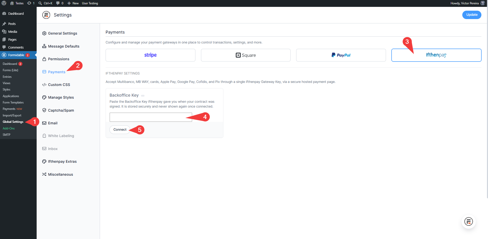
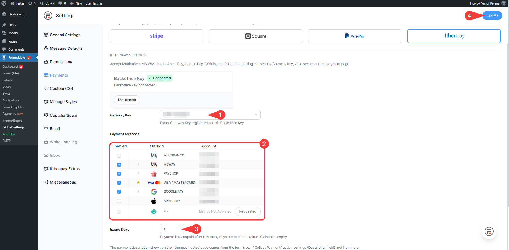
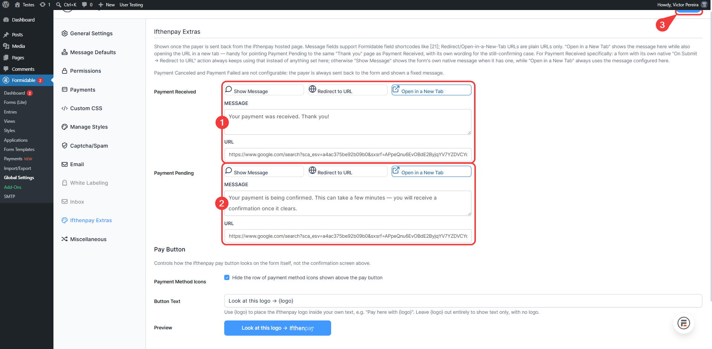
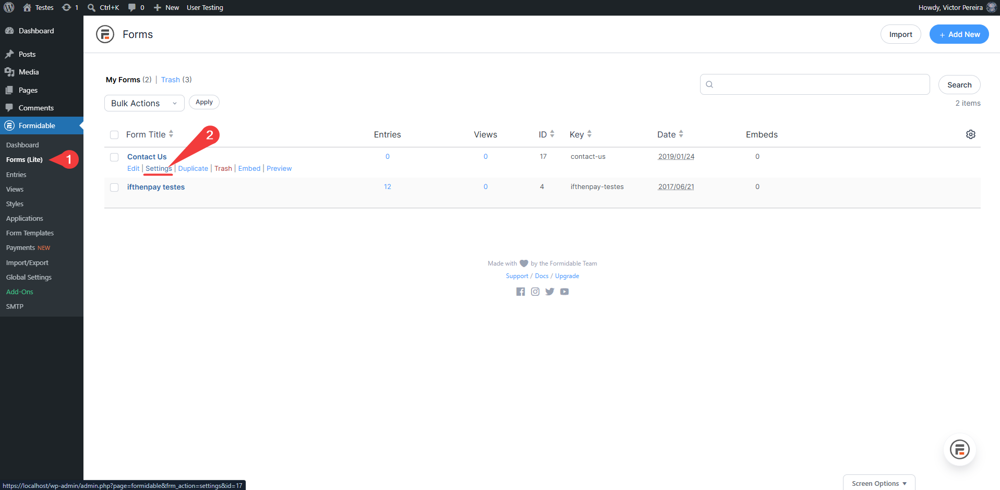
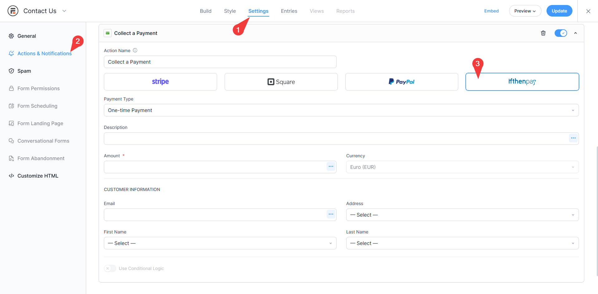
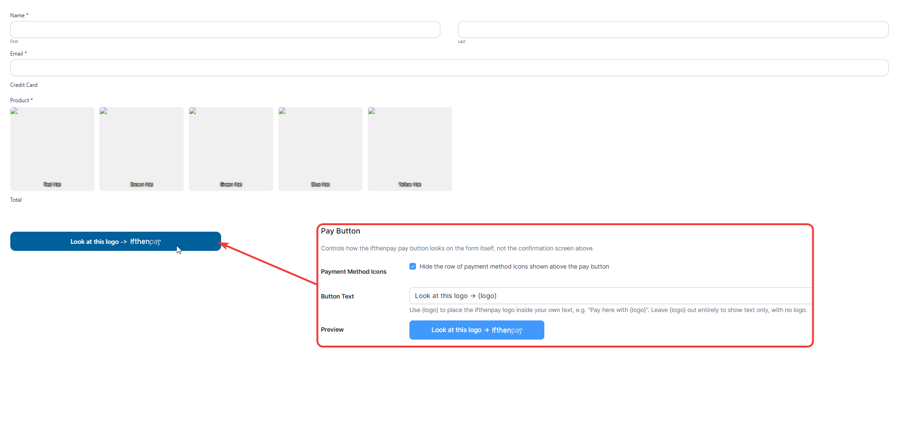
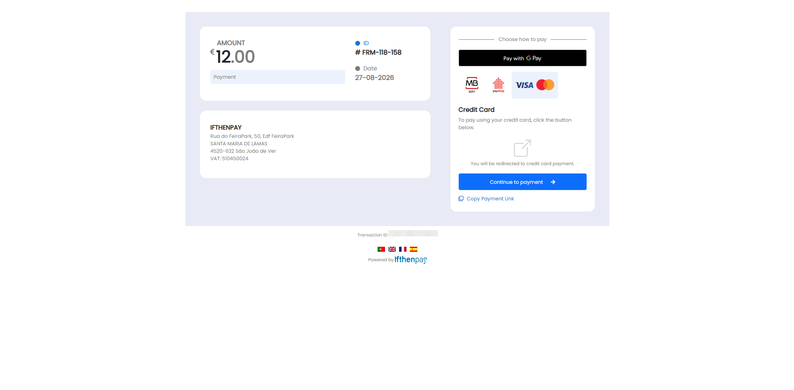
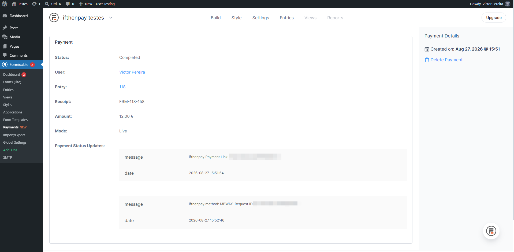

# ifthenpay | Payments for Formidable Forms

Accept Multibanco, MB WAY, cards, Apple Pay, Google Pay, Payshop, Cofidis, and Pix on your Formidable Forms "Collect a Payment" action via ifthenpay's hosted Pay by Link page.

---

## Table of Contents

- [Description](#description)
- [Key Features](#key-features)
- [Requirements](#requirements)
- [Installation](#installation)
- [Form Setup](#form-setup)
- [Frequently Asked Questions](#frequently-asked-questions)
- [External Services](#external-services)
- [Screenshots](#screenshots)
- [Support](#support)

## Description

ifthenpay Payments for Formidable Forms adds ifthenpay as a payment option on Formidable's own "Collect a Payment" form action, alongside Stripe, Square, and PayPal. When a payer submits a form configured to collect a payment via ifthenpay, they are redirected to a secure ifthenpay-hosted payment page to complete the transaction. Once payment is confirmed, ifthenpay notifies your site automatically (server-to-server) and the payment status is updated in Formidable's own Payments list — the same place Stripe/Square/PayPal payments already show up. The merchant never sees or stores card, MB WAY, or bank data of any kind.

### In plain terms you get:

- One Gateway Key on your ifthenpay Backoffice, usable across every form on the site
- A live, editable table of every payment method provisioned on that Gateway Key, with per-method enable/disable and a default method
- Automatic, secure hosted-page checkout — no PCI scope on your server
- Real-time status sync back into Formidable's native Entries and Payments admin screens

All settings are made in Formidable's own Global Settings screen and in your ifthenpay Backoffice. The plugin is built so site owners can manage payments without needing deep technical knowledge.

## Key Features

1. Full integration with Formidable Forms' free "Collect a Payment" action, alongside Stripe/Square/PayPal
2. Secure, PCI-out-of-scope checkout via ifthenpay's own hosted Pay by Link page
3. Automatic payment confirmation via a dedicated server-to-server callback endpoint
4. Support for every payment method provisioned on your Gateway Key (e.g. Multibanco, MB WAY, Payshop, Visa/Mastercard, Apple Pay, Google Pay, Cofidis, Pix)
5. Configurable payment link expiry (in days)
6. Customizable Payment Received / Payment Pending confirmation messages, each with its own "Show Message", "Redirect to URL", or "Open in a New Tab" behavior
7. Customizable pay button text and logo placement, with payment-method icons shown above it
8. Real-time payment status in Formidable's own Entries and Payments admin lists
9. Multi-language hosted payment page (English, Portuguese, Spanish, French — based on your site's locale)
10. Security first — no card, MB WAY, or bank details ever stored on your server

## Requirements

- An active ifthenpay merchant account with a Backoffice Key — contact ifthenpay to get one.
- A Gateway Key registered to that Backoffice Key, with the payment methods you want to accept provisioned on it.
- Formidable Forms (free) installed and active, with its bundled free payments module. This plugin does not currently support sites using the separate paid Formidable "Payments" add-on.
- WordPress 6.3+ and PHP 7.4+.
- HTTPS (SSL) enabled on your site.

## Installation

1. **Install:** Install and activate Formidable Forms (if not already active), then upload and activate this plugin.
2. **Connect:** Go to `Formidable → Global Settings → Payments → ifthenpay` and connect your Backoffice Key.
3. **Configure:** Choose a Gateway Key, enable the payment methods you want to accept, pick a default method, and set a payment link expiry.
4. **Form setup:** On any form, add a "Collect a Payment" action and choose ifthenpay as the gateway.
5. **Optional:** Visit `Formidable → Global Settings → Ifthenpay Extras` to customize the Payment Received/Pending messages and the pay button's text and logo.

## Form Setup

Add a "Collect a Payment" action to any form (`Form → Settings → Actions & Notifications`), select **ifthenpay** as the gateway, set the amount and currency, then fill in customer information mapping as needed. The payment description shown on the ifthenpay hosted page comes from the action's own "Description" field, not from the global settings screen.

## Frequently Asked Questions

<strong>Does this plugin require Formidable Forms?</strong>

Yes. The free Formidable Forms plugin, with its bundled "Lite" payments module, must be installed and active. The plugin does not currently support sites using the separate paid Formidable "Payments" add-on.

<strong>Does it support recurring payments?</strong>

No. ifthenpay Pay by Link is a one-time payment per submission; the recurring payment type is hidden for the ifthenpay gateway on Formidable's own action settings screen.

<strong>Are payment details stored?</strong>

No. The plugin never stores card numbers, MB WAY numbers, or bank details — the payer completes payment entirely on ifthenpay's own hosted page. Your Backoffice Key is stored server-side only and is never exposed to the browser once connected.

<strong>Which payment methods are supported?</strong>

Any method ifthenpay provisions on your Gateway Key — commonly Multibanco, MB WAY, Payshop, Visa/Mastercard, Apple Pay, Google Pay, Cofidis, and Pix. The methods table on the settings screen always reflects exactly what's active on your account.

<strong>How does the payment process work?</strong>

After the form is submitted, the entry is created and the payer is redirected to ifthenpay's hosted payment page. Once they complete payment, ifthenpay calls your site's callback endpoint to confirm it, and the entry's payment status updates automatically — no polling or manual action needed.

<strong>What happens if a payment fails or is canceled?</strong>

The payer is sent back to your site and shown a fixed message. The Formidable entry itself is still created (in a pending state) so the submission isn't lost, and a payer can return to the same payment link to complete payment later if it's still valid.

<strong>Can I customize the payment experience?</strong>

Yes. You can customize the Payment Received and Payment Pending messages (and choose whether each shows a message, redirects, or opens a new tab), the pay button's text, and whether payment-method icons are shown, all from `Formidable → Global Settings → Ifthenpay Extras`.

<strong>Is there a sandbox?</strong>

ifthenpay may provide test entities for a Gateway Key on request; otherwise, use a low-value live test to confirm your setup end-to-end.

<strong>How secure is the integration?</strong>

All requests to the ifthenpay API are made server-side over HTTPS. The webhook callback is authenticated with an anti-phishing key unique to your Gateway Key, and each payment's amount is verified against the stored record before being marked complete.

## External Services

This plugin connects to the ifthenpay API (`https://api.ifthenpay.com`) to process payments for Formidable Forms submissions. ifthenpay is a third-party Portuguese payment service provider supporting Multibanco, MB WAY, Payshop, card payments, Apple Pay, Google Pay, Cofidis, and Pix.

- **Formidable Forms**
  - **What it is and what it is used for**: The host plugin's free "Collect a Payment" form action and its bundled Lite payments module. This plugin registers ifthenpay as an additional gateway inside that existing payment flow and writes payment records into Formidable's own payments table.

- **ifthenpay API & Backoffice**
  - **What it is and what it is used for**: The ifthenpay Backoffice is the merchant dashboard used to manage your account and Gateway Keys. The plugin calls the ifthenpay API to validate your Backoffice Key, list Gateway Keys and their provisioned payment methods, create a Pay by Link payment session, register the webhook callback URL, and (optionally) look up a payment's live status.
  - **What data is sent and when**:
    - When connecting your account: your Backoffice Key (to validate it and list Gateway Keys).
    - When loading the settings screen: your Backoffice Key and Gateway Key (to fetch the live payment-methods table).
    - When a form is submitted with an ifthenpay payment action: a payment reference id, the amount, an optional description, the enabled accounts string, success/error/cancel return URLs, an OTP flag, the site's language, an optional link-expiry date, and the pre-selected default method.
    - When saving settings: the Gateway Key and your site's callback URL (to register/refresh the webhook).
    - When a real-time status check is made after redirect (`/gateway/transaction/status/get`): the transaction id ifthenpay returned for that payment.
  - **Terms of Service**: [ifthenpay Terms and Conditions](https://ifthenpay.com/termos-e-condicoes/)
  - **Privacy Policy**: [ifthenpay Privacy Policy](https://ifthenpay.com/politica-de-privacidade/)

All network requests are performed server-side over HTTPS. No card, MB WAY, or bank details are ever collected or stored on your server.

## Screenshots

1. **Global Settings → Payments — the ifthenpay tab sits alongside Stripe, Square, and PayPal.**

2. **ifthenpay settings — Backoffice Key connected, Gateway Key selected, and the live payment-methods table.**

3. **ifthenpay Extras tab — Payment Received / Payment Pending message and redirect behavior.**

4. **Formidable's Forms list — where to open a form's own Settings to add a payment action.**

5. **A form's "Collect a Payment" action, configured with ifthenpay as the gateway.**

6. **The front-end pay button on a live form, with a custom logo-and-text label.**

7. **ifthenpay's hosted Pay by Link page, showing the available payment methods for that transaction.**

8. **A completed ifthenpay payment shown in Formidable's native Payments list.**

## Support

For assistance use the [WordPress.org support forum](https://wordpress.org/support/plugin/ifthenpay-payments-for-formidable-forms):

Pre-checks:

- Payment method enabled on your Gateway Key AND enabled on the ifthenpay settings screen
- Running current recommended versions of WordPress, PHP, and Formidable Forms
- Webhook callback URL reachable (not blocked by a firewall, security plugin, or maintenance mode)

- **ifthenpay support**: contact your ifthenpay account manager or [ifthenpay.com](https://ifthenpay.com/)
- **Formidable Forms docs**: [Formidable Forms documentation](https://formidableforms.com/knowledgebase/)
